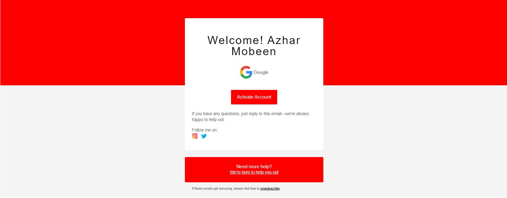

> AZ-FreeMarker-Email
* It's a simple spring boot microservice which will simply have one controller `EmailController` and it will 
send emails to requested receiver email address.
* Important point is: We'll use `Apache FreeMarker` template engine for emails.

> Technologies:
* Java 8
* Spring boot
* Apache FreeMarker
* SpringDoc-OpenAPI
* Java-Mail-Sender

> How to run
* Windows
```
.\gradlew clean build bootRun
```
* Others
```
./gradlew clean build bootRun
```

> How to test
* After running the application please [click here](http://localhost:8080/swagger-ui/index.html)
```
http://localhost:8080/swagger-ui/index.html
```
* All the endpoint available there

> Note for Google Password
* It's not good to store your password in the properties you can generate temporary password for specific apps
* Please [check this](https://support.google.com/accounts/answer/185833?visit_id=637879398097578861-2133560723&p=InvalidSecondFactor&rd=1)

> Output:
